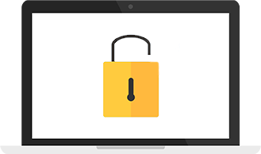

# Cryptojourney

Learn the basics of cryptography throughout history.

Cryptojourney is teacher, student and parent friendly. The content can be used in the classroom either on or offline, by students for reference and self-study, and by parents for home-schooling.

Website: https://cryptojourney.com/

# Table of contents

- [Chapters](#chapters)
- [Contributing](#contributing)
    + [Using the issue tracker](#using-the-issue-tracker)
    + [Issues and labels](#issues-and-labels)
    + [Guidelines for bug reports](#guidelines-for-bug-reports)
    + [Security](#security)
- [Authors](#authors)
- [License](#license)

# Chapters

**1. Foundations**

This chapter will provide you with a basic foundation in cryptography and some terminology that you will need for your journey.

1.1 What Is Cryptography?

1.2 Terminology

1.3 Different Ciphers & Algorithms

**2. Classical Cryptography**

Learn about the earliest methods used to encrypt messages.

2.1 Egypt

2.2 Ancient India

2.3 Hebrews

2.4 Ancient Greece & Sparta

2.5 Rome

**3. WWI**

Discover cryptographic principles used during World War I.

3.1 The Importance Of Cryptography During WW1

3.2 Playfair Cipher

3.3 The Zimmermann Telegram

**4. WWII**

In this chapter you will learn about the various cipher machines used during World War II.

4.1 The Importance Of Cryptography During WW2

4.2 Enigma

4.3 The Polish Bomba

4.4 The British Bombe

4.5 Lorenz Cipher

4.6 Bletchley Park

4.7 Purple

**5. Cold War**

Cryptography during the Cold War.

5.1 Why We Know So Little About Cold War Cryptography?

5.2 Fialka

**6. Modern**

Learn about the ways we keep our data secure today.

6.1 Timeline

6.2 The Key

6.3 Simple XOR

6.4 Random & Pseudo-random

6.5 Prime Numbers

6.6 One-Time Pads

6.7 Cryptographic Protocols

# Contributing

We welcome contributions from the public.

### Using the issue tracker 💡

The issue tracker is the preferred channel for bug reports and features requests.

### Issues and labels 🏷

Our bug tracker utilizes several labels to help organize and identify issues.

### Guidelines for bug reports 🐛

Use the GitHub issue search — check if the issue has already been reported.

A good bug report shouldn't leave others needing to chase you up for more information. Please try to be as detailed as possible in your report.

### Security 💻

We take security very seriously at Cryptojourney. We welcome reports from security researchers to ensure Cryptojourney follows the latest recommendations in security.

**We are not interested in social engineering reports.**

We give credit to valid reports in our Hall of Fame.

Please submit reports by opening issues on GitHub.

# Authors

Cryptojourney was created by [@EdOverflow](https://github.com/edoverflow) and [@YouPunk](https://github.com/YouPunk) as a final year project.

# License

By contributing your code, you agree to license your contribution under the MIT License. By contributing to the chapters on cryptography, you agree to license your contribution under the Creative Commons Attribution 4.0 International License.