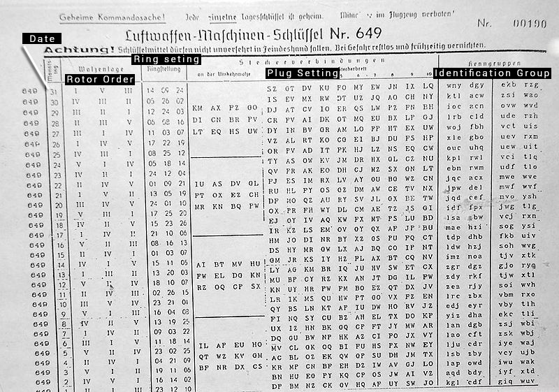

# Cryptojourney

Written by @EdOverflow & @YouPunk.

# Table of contents

- [1. Foundations](#1-foundations)
- [2. Classical Cryptography](#2-classical-cryptography)
- [3. WWI](#3-wwi)
- [4. WWII](#4-wwii)
- [5. Cold War](#5-cold-war)
- [6. Modern-day Cryptography](#6-modern-day-cryptography)

# 1. Foundations

# 2. Classical Cryptography

### Egypt

According to David Kahn's "The Codebreakers"[1], the earliest use of cryptography is found in an Egyptian tomb belonging to Khnumhotep II. Researchers found unusual hieroglyphs carved into the walls that date back to 2000 BC. This method is known as symbol substitution and is a very important element of cryptography that is still used today. Interestingly though, Khnumotep II's intentions were not to hide the text, but rather to impress the reader.

---

###	Ancient India

We have well documented evidence, that cryptography was prevalent in ancient India too, especially among traders, thieves and robbers. Number 44 of the 64 arts that Vatsyayana listed in his book "Vatsyayana's Kama Sutra" is Mlecchita Vikalpa: "The art of understanding writing in cipher, and the writing of words in a peculiar way."[2] Ancient Indian ciphers such as the Muladeviya, a simplified form of Kautiliya, consisted mainly of letter substitutions, which were based on phonetic relations.

~~~
Plain:  | a | kh | gh | c | t | ñ | n | r | l | y |
Cipher: | k | g  | ṅ  | ṭ | p | ṇ | m | ṣ | s | ś |
~~~

---

### Rome

One of the earliest known and simplest ciphers, the Caesar cipher, is a shift cipher, which means it encrypts by shifting all the letters in a piece of text by a certain number of places. It was named after Julius Caesar, who used it to encrypt messages sent to his generals. Caesar ciphers are very simple to create, but are also very easy to crack. The key for this cipher is a letter which represents the number of shifts in the alphabet. So for example, a key of E means "shift 4 places". The key Z can either mean "shift 25 places" or "shift one place backwards".

#### :mortar_board: Example

The word "HELP" with the key J becomes "ROVZ".

~~~~
ABCDEFGHIJKLMNOPQRSTUVWXYZ
KLMNOPQRSTUVWXYZABCDEFGHIJ
~~~~

Caesar's method is a weak encryption method, since there are only 26 possibilities. The Enigma machine used in World War II by the German military had over 158 quintillion combinations! To crack the Caesar cipher we can also use a method called frequency analysis. This is where the number of times each letter occurs is analysed. The frequency of the most commonly occurring letters in the cipher text correspond to the most common in the plaintext (etaoin shrdlu).

#### :mortar_board: Example

The following cipher text is given:

~~~~
RYYVBGWHFGNGRPU
~~~~

After analysing the text we get:

| Letter | Percentage | Number of occurrences |
|--------|------------|-----------------------|
| N      | 6.67%      | 1                     |   
| P      | 6.67%      | 1                     |   
| U      | 6.67%      | 1                     |   
| F      | 6.67%      | 1                     |   
| W      | 6.67%      | 1                     |   
| V      | 6.67%      | 1                     |   
| B      | 6.67%      | 1                     |   
| H      | 6.67%      | 1                     |   
| R      | 13.33%     | 2                     |   
| Y      | 13.33%     | 2                     |   
| G      | 20.0%      | 3                     |  

Now we compare the most common letters from the cipher text with the most common English letters: `etaoin shrdlu`

~~~~
If cipher text `G` is plaintext `E`, then the shift is `2`.
Result: pwwtzeufdelepns

Else if cipher text `G` is plaintext `T`, then the shift is `13`.
Result: elliotjustatech
~~~~

#### :hourglass: Challenge

It is believed that Julius Caesar used a key of E when encrypting messages. Try to decrypt this message Caesar sent to one of his generals.

  
**M leh vexliv fi jmvwx mr e zmppeki xler wigsrh ex Vsqi.**

	**Solution:** I had rather be first in a village than second at Rome.

---

### The Hebrews

The Hebrews used a simple monoalphabetic substitution cipher known as "atbash". The alphabet is simply reversed as follows:

~~~
Plain:  ABCDEFGHIJKLMNOPQRSTUVWXYZ
Cipher: ZYXWVUTSRQPONMLKJIHGFEDCBA
~~~

---

### Ancient Greece & Sparta

The Ancient Greeks and the Spartans used a scytale to transport their messages safely. A scytale is a rod with a strip wrapped around it. The message is written on the strip and in order for the receiver to decipher the secret message, they must wrap the strip around a rod of same diameter as the one used to encrypt the message.

#### :mortar_board: Example

Hermes comes running up to you and hands you his belt. You realise that there are letters engraved into the belt. You look back up and Hermes has already vanished. When placing the belt flat on the table, the following can be read: `BSRITOOEO:NILT)`
 
You have not got a stick lying around, so you start by drawing tables. There are 15 letters in total, which means, in order to fill all fields, we must draw a `3x5` table.

~~~
| B | S | R | I | T |
---------------------
| O | O | E | O | : |
---------------------
| N | I | L | T | ) |
~~~

Now when you read the table from top to bottom you get: `Bonsoir Eliott :)`

# 3. WWI

### The Importance of Cryptography during World War I

Encryption was vital during WWI, because nations did not want their enemies to be able to read their military secrets. Plans and military operations had to be kept under strict protection. Messages that were intercepted and decrypted by enemies changed the war drastically. The most notable case was the Zimmerman telegram, decrypted by the British Naval intelligence that helped bring the United States into the war.

WWI cryptography was not very sophisticated, cryptographers would mostly use substitution ciphers or mathematical encryption for important messages. The ciphers they used had to be explained in codebooks that were distributed to military personnel. This was a major weakness, since the books could be stolen by spies or enemy forces.

### The Zimmermann Telegram

The Zimmermann Telegram was a note from Germany requesting Mexican allegiance. It was wirelessly intercepted and then decrypted by the British. The contents of the letter gave the USA another reason to join World War I.

On 17 January 1917, the team of British codebreakers from Room 40 at Admiralty received the intercepted letter. They soon realized the number 13042 was a variation of 13040, the title number of a German codebook. The codebreakers managed to recreate the codebook with all sorts of intercepted messages they had managed to get hold of. Using the book the signature 97556 decoded to Zimmermann, revealing that Arthur Zimmermann had sent the note to the German ambassador in Mexico.

# 4. WWII

### The Importance of Cryptography during World War II

Cryptography played a much bigger role in World War II as opposed to World War I. In World War II cryptography was more sophisticated and the ciphers and machines they used were far more complex. The practice of cryptanalysis was also much more advanced and every country tried to improve their ability to encrypt/decrypt messages.

The most important event was the decryption of the German Enigma machine by the cryptographers at Bletchley Park. With the help of Ultra, the decrypted Enigma messages, the allies were able to read Germany's military intelligence throughout the war.

### The Enigma Machine

Enigma machines were a series of rotor cipher machines, originally used by companies, banks and later by the German military during WWII to encrypt messages. The main difference to classical cryptographic methods, was the fact that the cipher was polyalphabetic. The key changed for each individual letter you enciphered. So for example, you might press a `J` and end up with an `E` the first time and a `B` the second time.

The early Enigma machine consisted of a keyboard, a lampboard and three rotors with 26 letters each. When a key was pressed a letter flashed on the lampboard and the right rotor turned one step. Once the right rotor had made one full revolution, it kicked the middle rotor by one step and so forth, just like an [odometer](https://upload.wikimedia.org/wikipedia/commons/thumb/0/0b/Odometer_70000.jpg/800px-Odometer_70000.jpg). So if you set the rotors to A-B-C, the following would happen:

~~~
A-B-C -> A-B-D ... A-B-Z -> A-C-A
~~~

When the German military saw the potential of the machine, they used various methods to insure better security. First they increased the number of rotors to four `4 * 3 * 2 = 24 permutations`. They then added a plugboard, which paired letters together with 10 wires `26! / (6! * 10! * 2^10) = 150'738'274'937'250 permutations`.

~~~
Total combinations: 1054560 * 150,738,274,937,250 = 158,962,555,217,826,360,000 ≈ 1.59 * 10^20
~~~

So now that we know the different parts of an Enigma machine, lets have a look at how to set up the machine to encrypt and decrypt a message:

**The rotor order:** Numbered from one to three in Roman numerals (I-III), each rotor was wired up differently and when placed on the rack in different order, they gave a different output.

**The ring setting:** The numbers displayed through little holes next to the rotors, indicated the ring setting. Each rotor was assigned a ring setting.

**The ground setting:** The key.

**Plugging:** Two letters could be connected together with a wire.

**The reflector wheel:** The circuit passed through the rotors and was then reflected back through the three rotors.

#### :mortar_board: Example

You have got hold of an Enigma machine and a stolen list for this month. The list says the following:

~~~
Datum (date DD/MM/YY):              04/09/1939
Walzenlage (rotor order):           | I  | II | III |
Ringstellung (ring setting):        | 12 | 25 |  01 |
Steckerverbindungen (plug setting): AF DU LQ VZ PI WX HM OF GD SC
Kenngruppen (identification group): LOL
~~~

1. This means you must set rotor `I` to 12, rotor `II` to position 25 and rotor `III` to 1.

2. Next you place rotor `I` in the left slot, rotor `II` in the middle slot and rotor `III` in the right slot. Rotor `III` will spin the fastest.

3. Now that all of that is done, you must connect all the pairs listed above together. `A` with `F`, `D` with `U` and so on.

The following steps were taken to ensure that both ends could communicate:

1. Both sender and recipient had to have the same machine, or at least both machines had to be configured so as to be in the same state. This means the same reflector wheel, rotor order, ring setting and ground setting were used to encrypt and decrypt the message.

2. Everyday these settings changed and so German operators were handed out keylists of all the different settings for the month. If the enemy got hold of a list, which they did sometimes, the list became useless once the month was over. Obviously, if there was any suspicion of a missing keylist, the Germans would have generated a new one. Keylists were either distributed in printed form or over radio as Morse code. The German Navy used ink that disappeared in water, so that when a ship sank the keylist was destroyed.

Now if both ends have followed all these steps accordingly, the sender could encrypt `HELLO` with his machine, which might output something like `UZCFS`. The receiver can then type `UZCFS` into his machine and it should output `HELLO`.

---

### The Polish Bomba

The Polish mathematician and cryptologist Marian Rejewski was the first one to design a machine that was able to decrypt messages encrypted with an Enigma machine. Because the Germans used to write the combination key at the start of every transmission, Marian Rejewski was able to recreate the internal wirings of the Enigma machine. In order to speed up the process of decrypting the key, he created the "Bomba Kryptologiczna" in October 1938. Six Bombas were built in Warsaw before September 1939. It took a Bomba about two hours to find out the daily keys. The Polish cryptographers were already reading Enigma encrypted messages by 1939 but they did not tell their British or French allies. Then by the end of 1938 the Germans added two more rotors, so that an operator had to choose three out of five rotors to put in the Enigma machine. The Polish cryptologists were not able to decrypt the messages anymore. In 1939 with the invasion of Poland, the Polish cryptographers decided to share their data with the French and the British.

---

### The Bombe

The Bombe was a device used by the British cryptologists at Bletchley Park to decode German Enigma messages during WWII. The Bombe was designed in 1939 at the UK Government Code and Cypher School (GC&CS), a peace-time codebreaking agency, by Alan Turing and Gordon Welchman.
In order to decrypt Enigma messages the Bombe had to find out the relative starting positions of the Enigma rotors, the cross-pluggings of the Enigma plugboard and the order of the rotors. The Bombe could not solve everything on its own, therefore some work had to be done by the codebreakers manually. For instance likely pieces of plain-text known as Cribs had to be found by the codebreakers and then inserted into the Bombe machine.

#### Roll of Drums

The Bombe had to do one thing, it had to replicate the action of several Enigma machines. A standard British Bombe replicated the actions of 36 Enigma machines wired together, each with 3 drums connected to them to produce the same effect as the Enigma rotors. To recreate the Enigma rotors actions, each rotor drum of the Bombe had two sets of contact and 104 wire brushes that were arranged in four circles, 2 input and 2 output circles. The circles were arranged, so that the 2 output circles were connected with the current passing through the rotors, and the 2 input circles were connected with the current passing in the other direction.

---

### Lorenz Cipher

Another cipher machine, which the German military used towards the end of WWII is the Lorenz machine. The Lorenz machine was a rotor stream cipher machine often used by Nazi High Command and famously known to have been Adolf Hitler's cipher of choice. Lorenz machines were attached to teleprinters, in order to encrypt important messages. Each machine model starts with an SZ abbreviation (SZ-40, SZ-42, etc.), which stands for "Schlüssel-Zusatz", the German for "cipher attachment".

#### :radio: The Machine

The Lorenz cipher machine, although not as famous as Enigma, was far more complex than Enigma. Lorenz machines had 12 rotor wheels and each wheel had a different number of pins, which could be set to on or off. The rotor wheels were divided into 3 groups, `χ` ("chi"), `ψ` ("psi") and `μ` ("mu"). `χ` and `ψ` wheels are key wheels and by adding both together they output a key.

~~~
Key = χ-Key + ψ-Key
~~~

`χ` wheels rotate after every letter that is typed, while `ψ` wheels do not change regularly. The two middle `μ` wheels are responsible for the rotation of the `χ` and `ψ` wheels, and are therefore called motor wheels.

| Rotor number:  |1  |2  |3  |4  |5  |6  |7  |8  |9  |10 |11 |12 |
|----------------|---|---|---|---|---|---|---|---|---|---|---|---|
|Type:           | ψ | ψ | ψ | ψ | ψ | μ | μ | χ | χ | χ | χ | χ |
|Number of pins: |43 |47 |51 |53 |59 |37 |61 |41 |31 |29 |26 |23 |

Lorenz machines used an enciphering method proposed by the American scientist, Gilbert Vernam, to encrypt teleprinter messages. Letters were represented as dots ("•") and crosses ("x") and in order to encrypt the message, the typed letter was XOR'd with the key letter. The XOR of `(•,•)` is `•`; `(•,x)` is `x`; `(x,•)` is `x`; and `(x,x)` is `•`.

~~~
Letter A: x x • • •
   Key C: • x x x •
------------------- (XOR)
Cipher F: x • x x •
~~~

#### The Codebreakers

The codebreakers at Bletchley Park who managed to crack Lorenz cipher messages referred to Lorenz machine traffic as Tunny, the old English word for tuna. When the first messages were intercepted, there were clear signs that this could not come from an Enigma machine.

---

### Bletchley Park

Bletchley Park was the home of the British Codebreakers during World War II, and was run by the Government Code and Cypher School (GC&CS). The park is located in Buckinghamshire, England. The advantage of the parks location was its centrality. It was just in the middle of the Oxford and Cambridge universities who supplied many code-breakers. Bletchley Park is famous for cracking naval Enigma and Lorenz codes. Although many incredible minds worked together to decode messages at Bletchley, the most famous codebreaker remains Alan Turing. In 1945 Bletchley Park had about 10‘000 code-breakers at their service, 75% of them were women, due to the lack of men, who had been sent to war. The extreme secrecy around Bletchley Park meant that many of the achievements were not revealed until decades later. All staff members had to sign the Official Secrets Act to ensure their loyalty. They were told not to talk about Britain's "Ultra secret" or any of the intelligence acquired by decrypting enemy messages and signals. Members were not even allowed to share this information with their relatives or discuss it at Bletchley Park. This discretion was partially respected, since Germany had no idea about Britain's success, even though we know today, that Bletchley Park had been infiltrated by a Soviet spy that leaked information about the "Ultra secret". Today, Bletchley Park is a famous tourist attraction.

#### :hourglass: Challenge

  
Why is it important that codebreaking agencies are hidden and operated in secret?

	**Solution**: If enemies were to find out about a codebreaking agency, they could send spies, improve their encryption methods and possibly send fake messages to put off the enemy.

---

### Purple

In the early 1930s, the Japanese Navy purchased a German Enigma machine and improved the security of the machine. This new machine was codenamed "Red" by the US government and was one of the most secure cryptographic machines in the world. The American Army Signal Intelligence Service (SIS) led by William Friedman managed to crack the machine in 1936, thus being able to read Japan's top secret communications. However in 1939, Japan's Foreign Ministry presented a newly improved cipher machine called "Purple". This machine was so secure, and so much better than its predecessor "Red", that even the US thought it was unbreakable. Purple was used in World War II to encrypt classified Japanese information. Purple, unlike Enigma, was only used in Japanese embassies, and not on the battlefield, which means that enemies and even allies of Japan had no idea such a machine existed. This is also why the US had a lot of trouble cracking the machine, since they had no idea how it looked like, they could not even start to try and break it.

The message, that broke off negotiations and then led to a war between America and Japan, was sent through Purple.

In 1929, the Us Army hired William F. Friedman, to lead the SIS and to crack the Purple machine. The best way to crack a cipher machine, was to create an exact replica of it. In 1940, the US with the help of spies managed to create eight replica Purple machines, and they were finally able to decode many Purple encrypted messages. Decoded messages of the Purple cipher were codenamed "Magic" by the US government, which is similar to "Ultra", the British Enigma decryptions. The US Army was aware of Japan's most secret communications. Thanks to Magic, the US Army was able to read Japanese plans and obtained vital information regarding the war in Europe. Spies around the world tried to tell the Japanese government, that Purple had been broken, but the Japanese were so confident in the security of their machines that they simply ignored all warnings.

#### :radio: The Machine

A Purple machine consisted of two electronic typewriters connected to a plugboard and a box containing the cryptographic elements within a network of wiring. The plugboard had a plug for each letter in the Roman alphabet. Just like the German Enigma machine, Purple would not encipher any letter to itself, meaning that an `A` entered on the electronic typewriter would never be outputted as an `A` in the cipher text. When plaintext was typed on the first electronic typewriter, the input keyboard, it passed through a plugboard which separated the letters. The separated letters were then sent to two different groups. The first group consisted of 6 vowels (`AEIOUY`) and the second group of 20 consonants (`BCDFGHJKLMNPQRSTVWXZ`). This feature of Purple was called the "6-20 split." The first group was called the "sixes" and the second group was called the "twenties". After passing through the input plugboard the letter is denoted by `S` in the image below, if the letter is in the "sixes". The letter is then sent to the output plugboard. On the other hand, if the letter is in the "twenties" the letter passes through three permutations, `L`, `M`, and `R` in the image below, and is then sent to the output plugboard. As you can see below the "sixes" will be permuted to "sixes" and the "twenties" will be permuted to "twenties" which is the weakness of the Purple machine and was exploited by the US.

The Japanese also used modified versions of Purple (Coral and Jade), these cipher machines did not use the "6-20 split." Unlike the German Enigma machine, which used rotors to permute letters, the Purple machine uses switches, each step of a switch permutes the letter. That is why Purple is referred as a "stepping switch machine". Unlike the Enigma machine, the Purple permutations were not made to be changed, that is another major weakness of the cipher machine. [3]

# 5. Cold War
The cold war was a state of military tension, that lasted from circa 1947 to 1991, the collapse of the Soviet Union. We still know very little about the encryption methods Russia and America used, because it is still classified and secret information.

  
Why is this information still classified?
        Solution: Some of the methods and machinery used in the Cold War could still be in use today.

### Fialka M-125
The Fialka M-125 was a polyalphabetic rotor cipher machine used by the Russians during the Cold War. The name comes from the Russian for the “viola” flower.

#### :radio: The Machine
The Fialka had 10 rotors, with 30 contacts each. Every rotor had mechanical pins and turn-over points. Instead of a plugboard like some Enigma machines had, Fialka M-125 operators inserted a punch holed key card. This method was easier and more secure than a plugboard.

~~~~
Input -> Key card -> Rotors -> Reflector -> Rotors -> Output
~~~~

# 6. Modern-day Cryptography
